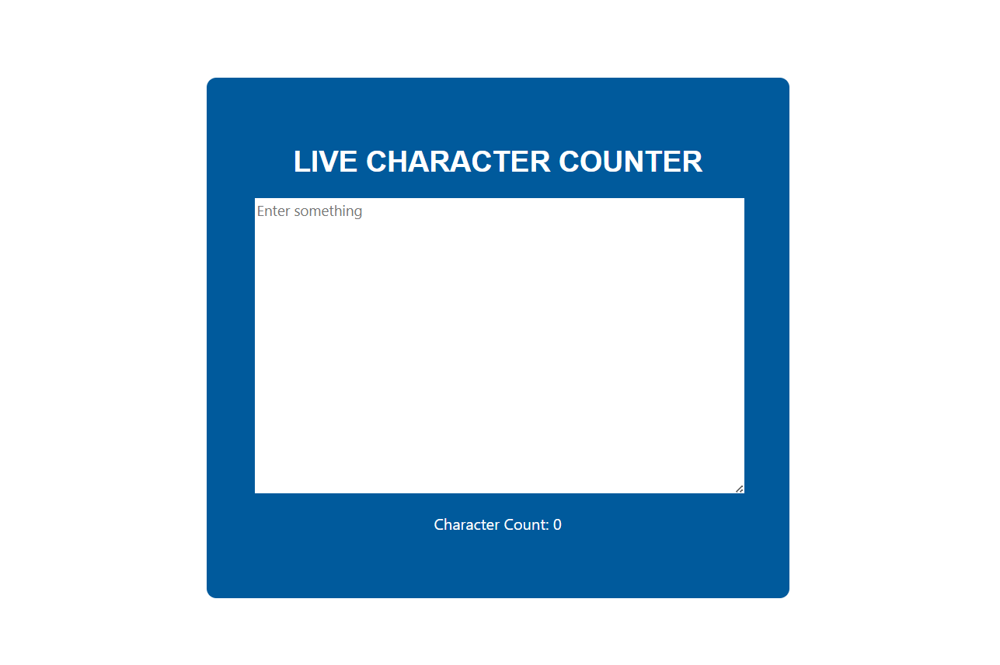

# 📝 Live Character Counter (React)

A simple React application that counts the number of characters entered into a text area in real-time. This project is beginner-friendly and demonstrates the use of **React Hooks (`useState`)**.

## 📌 Features
- ✅ **Live Character Count**: Updates instantly as you type.
- ✅ **Minimalist UI**: Clean and simple design.
- ✅ **Beginner-Friendly**: Uses basic React concepts (`useState`).
- ✅ **Custom Styling**: Styled using CSS.

## 🛠️ Technologies Used
- ⚛️ **React** (useState Hook for state management)
- 💻 **JavaScript** (ES6+ features for clean and efficient code)
- 🎨 **CSS** (for a stylish and minimal design)
- 📄 **HTML** (for structured content)

## 🚀 Live Demo
To see it in action, clone the repository and follow the setup instructions below.

## 🚀 Getting Started

1. **Clone the repository:**
   git clone https://github.com/Eshhaa11/character-counter

2. **Navigate to the project directory:**    
   cd react-counter-app

3. **Install dependencies:**
   npm install

4. **Start the development server:**
   npm start

5. **Open your browser and visit:**
   http://localhost:3000

## 🎨 Screenshots

## 🤝 Contributing
Excited to improve this project? Fork the repository, create a feature branch, and open a pull request. Every contribution helps make it better! 🚀✨

🎉 Happy Coding! 🚀